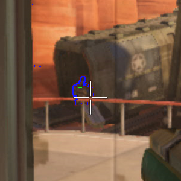
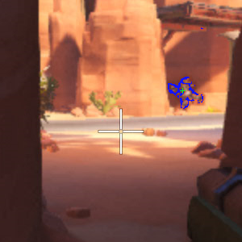
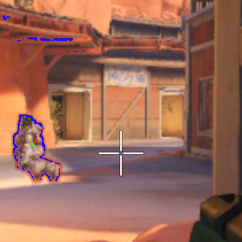
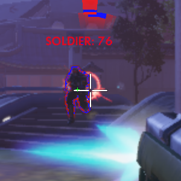
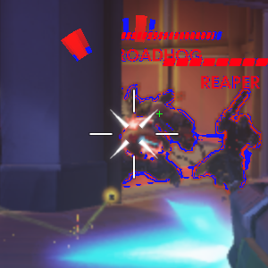
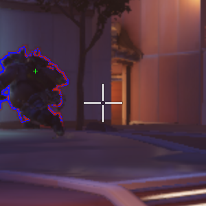
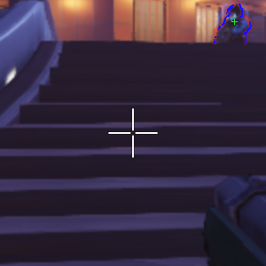

# POC-AimBot-Overwatch

POC aimbot ("auto-aim") on the game Overwatch.

**Note: This program has not been used during a real game of Overwatch. Demonstrations (images and videos) were performed on video recordings of games.**

**Update: The source files of this repository have been removed after an agreement with the Blizzard Company.**

## Overall functioning

This script uses the Python library *PIL* to recover the center of the main screen (as the sight of the gun is always at this position). A aimbot is mainly there for the accuracy, it is unnecessary to make treatments across the entire screenshot: the captured area is only 300x300 pixels (it also helps to reduce the computation times).

Enemy players on Overwatch are surrounded by a red border; treatments are therefore to detect these areas, then choose the closest. A simple cursor movement then enough to target the enemy player.

## Demonstrations

Examples of detected zones and the position selected as a target:

Two demonstration videos on recordings are available on YouTube: [AimBot-Overwatch-Demo1](https://www.youtube.com/watch?v=SUJwXMd1s8Y), [AimBot-Overwatch-Demo2](https://www.youtube.com/watch?v=VDhz-but5dQ).

## Major concerns faced

- Enemy players are not the only ones on Overwatch to be red: all messages, indications of damage, explosions, limits checkpoints, decorations, ... can also contain red shades. The positions of the targets calculated are sometimes biased by these zones.
- Although the targets are computed on an area of 300x300 pixels, the program is relatively slow. To make these calculations in real-time on game records Overwatch, I had to slow down to half speed videos.

## The future of the project

I realized this project in order to better understand how could be achieved a aimbot. I have never used this program on a real game. Not wishing to see my Battle.net account banned, the project will no longer be updated.
